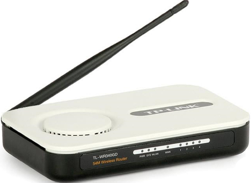

## Overview



## UART Pinout

## Minicom Configuration

```
CTRL-A Z for help | 38400 8N1 | NOR | Minicom 2.7.1 | VT102 | Online 0:27 | ttyUSB0
```

## UART Startup

```
AR2315 rev 0x00000090 startup...
Attached TCP/IP interface to ae unit 0
Attaching interface lo0...done

USRCONF : g_size = 20976
Name = MODULE_USR_CONF_T , size = 16
Name = UC_IEEE802_1X_CFG_DATA_T , size = 512
Name = UC_ADVANCED_CFG_T , size = 16
Name = UC_ARP_CFG_T , size = 652
Name = UC_BPA_CFG_DATA_T , size = 912
Name = UC_DDNS_T , size = 1480
Name = UC_DHCPC_CFG_DATA_T , size = 416
Name = UC_DHCPS_CFG_AND_STATIC_T , size = 708
Name = UC_FIRE_WALL_STATE_T , size = 1992
Name = UC_FORWARD_VIRTUAL_SERVE_CLASS_T , size = 1572
Name = UC_LAN_CFG_DATA_T , size = 16
Name = UC_L2TP_CFG_DATA_T , size = 1472
Name = UC_MAC_CONFIG_T , size = 80
Name = UC_PPPOE_CFG_DATA_T , size = 1664
Name = UC_NTP_PREFER_SRV_CFG_DATA_T , size = 184
Name = UC_STATIC_IP_CFG_DATA_T , size = 144
Name = UC_SATTIC_ROUTE_CFG_DATA_T , size = 648
Name = UC_MANAGE_USERS_T , size = 64
Name = UC_UTILITIES_T , size = 16
Name = UC_WANCONNTYPE_T , size = 16
Name = UC_WLAN_CFG_T , size = 5168
Name = UC_OPMODE_CFG_T , size = 4
Name = UC_PPTP_CFG_DATA_T , size = 1472
Name = UC_NETWORK_PSEUDO_T , size = 4
Name = UC_QOS_ROUTER_CONF_FLASH_T , size = 740
Name = UC_DHCPP_CFG_DATA_T , size = 1008
dsInit 1
wlanBridgeInit(): ucGetOpMode() 1
wireless access point starting...
Auto Channel Scan selected 2412 MHz, channel 1
wlan0 Ready
TDDP


                            Software Platform for ARM
  Copyright(C) 2001-2004 by TP-LINK TECHNOLOGIES CO., LTD.
  Creation date: Mar 16 2010, 16:33:28

  Press CTRL-B to enter bootmenu...

  Boot Menu:
     1:  Download application program
     2:  Modify Bootrom password
     3:  Exit the menu
     4:  Reboot
     5:  User commond line
        Enter your choice(1-4):
```

Only option 5 actually works:

```
     5:  User commond line
        Enter your choice(1-4):5


Please Input debug cmd:help
command         description
-------------------------------
help            print all commands
task            print task information
stack           print task stack
e               exit

Please Input debug cmd:
```

